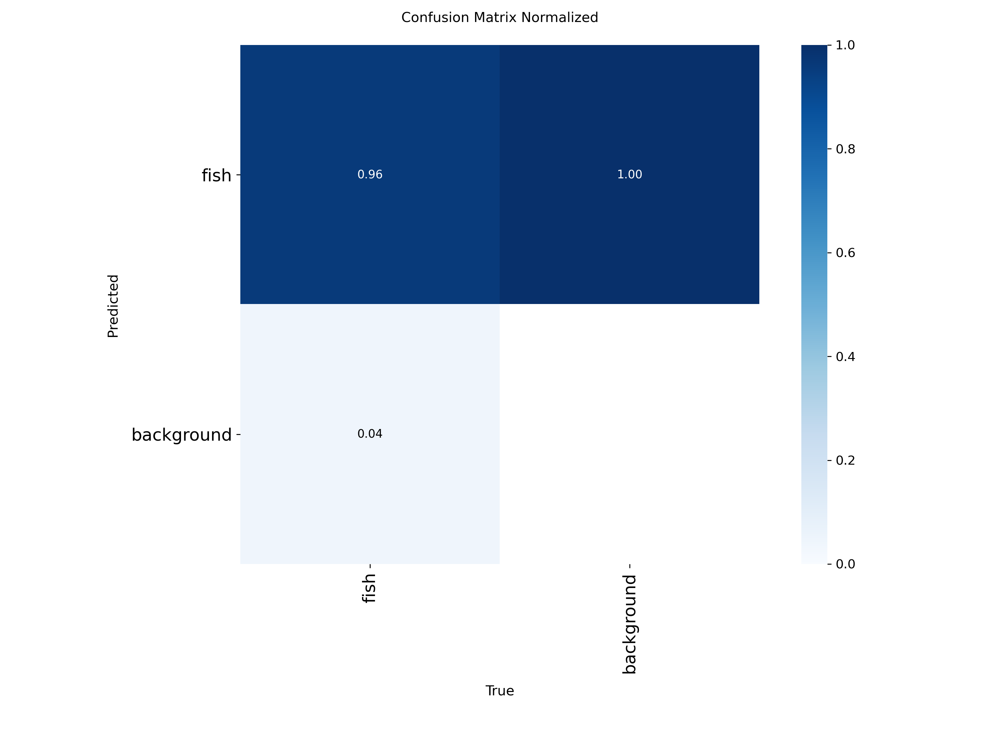
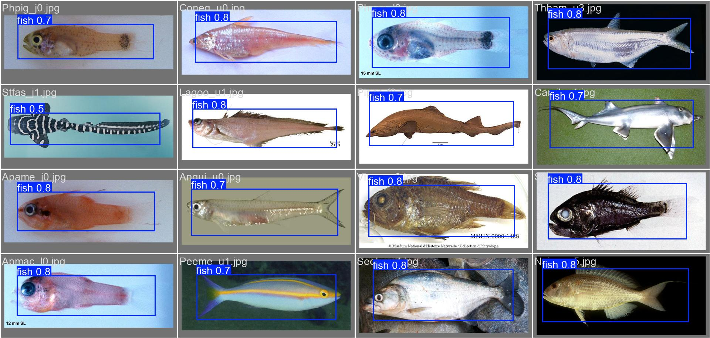

# 🎯 Final YOLOv8 Model Evaluation Report

## 📊 Core Performance Metrics

| Metric | Score | Definition |
| :--- | :---: | :--- |
| **Mean Average Precision (mAP@50)** | **94.9%** | The overall accuracy of the model correctly identifying a fish. |
| **Precision** | **93.8%** | When the AI boxed a fish, it was correct 94% of the time (low false-positive rate). |
| **Recall** | **94.4%** | Out of all the physical fish in the water, the AI spotted ~95% of them (low false-negative rate).|
| **Dataset Utilization** | **1,445 / 1,445** | Every single image was correctly loaded with a YOLO bounding box. |

## 📈 Confusion Matrix
The confusion matrix highlights a remarkably dense correlation mapping directly to the "Fish" detection logic on the independent Test set.

## 📸 Automated Test Set Predictions
Here is a raw snapshot generated by the AI evaluating the test set in real-time, proving highly accurate geometry encapsulation of the fish targets.

